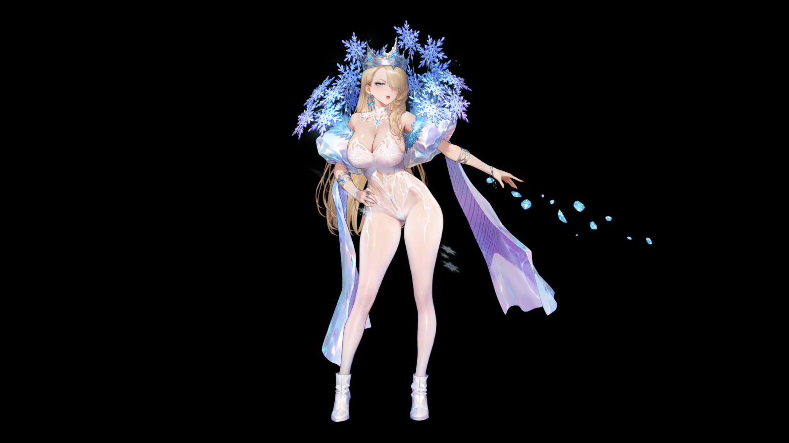
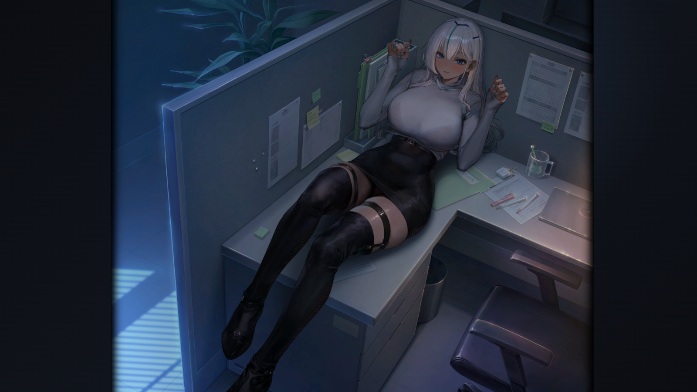

# 棕色尘埃2 立绘动态展示

一个用来看《棕色尘埃2》角色动画的网页播放器。

打开页面会随机出现一位角色。它播放的不是录屏，而是把游戏的 Spine 资源直接放进浏览器实时渲染：立绘会动，服装可以换，技能动作也能单独查看。鼠标移到屏幕左侧，菜单会滑出来，可以切换角色。

[打开网页](https://clam314.github.io/bd2web/)

## 角色动画

主页面是角色图鉴式的动画展示。

每次打开都会随机抽一位角色和一套服装，页面会自动进入适合欣赏的展示状态。也可以从菜单里手动切换角色、服装、待机、互动和技能动作。

技能动画不做硬凑的完整演出复刻，只把资源里真正能播放的动作列出来，保持图鉴页该有的样子：干净、直接。

  

## 有缘之客

[打开有缘之客页面](https://clam314.github.io/bd2web/dating.html)

“有缘之客”页面用来复现游戏里的互动插画。

这里不只是把资源摆出来，而是尽量还原游戏里的互动方式：阶段切换、画面热区、点击触发动作，部分语音和音效都会跟着当前角色状态走。打开热区显示可以看到哪些地方能点；关掉热区后，就是一张沉浸式插画。

  

## 说明

这是一个非官方项目，主要用于学习和展示 Spine 动画播放效果。

页面播放的是 Spine 动画资源，不是普通视频。部分技能动画不会复刻游戏里的完整相机、粒子和后处理演出。

请勿公开传播游戏素材。

## 致谢

感谢 [myssal/Brown-Dust-2-Asset](https://github.com/myssal/Brown-Dust-2-Asset) 整理和维护《棕色尘埃2》的公开 Spine 素材。
